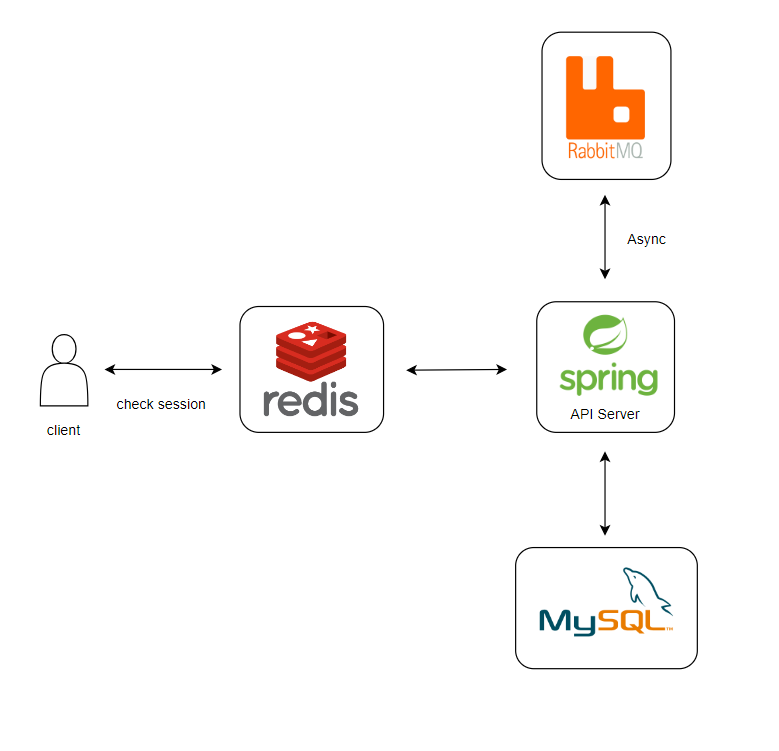
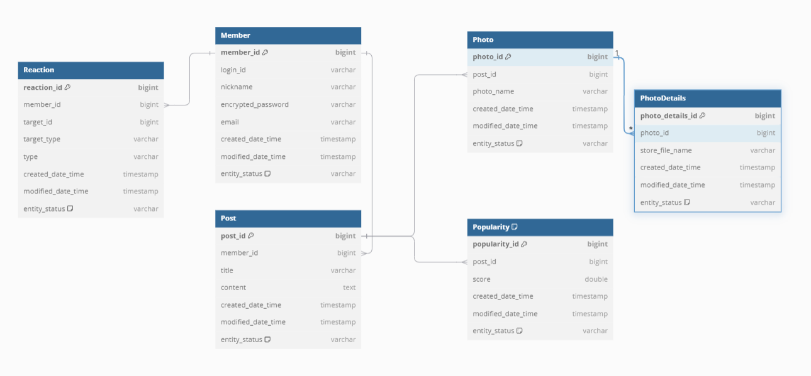

# Petpals 🐕

## Description of the Project

```asciidoc
자신이 기르는 동물의 사진을 공유하는 게시판 프로젝트로,
동물 사진과 함께한 게시글을 올리면 다른 이용자들과 공유할 수 있고, 마음에 드는 게시물에는 좋아요 버튼을 누를 수 있다.
메인 화면에는 최신 게시물, 인기 게시물을 보여준다.
```

## Stack

```asciidoc
Java: 21
Spring Boot: 3.3.1
Spring Data Jpa: 3.3.1
MySQL: 8.3.0
thymeleaf: 3.3.1
redis: 3.3.1
rabbitmq: 3.1.6
lombok: 1.18.32
```

## Service Architecture



## ERD



## API Docs

```asciidoc
* Member
 - (POST) api/member/login-id/check: 로그인 아이디 중복 체크
 - (POST) api/member/nickname/check: 닉네임 중복 체크
 - (POST) api/member/email/check: 이메일 중복 체크
 - (POST) api/member/auth-code/send: 이메일 인증코드 전송
 - (POST) api/member/auth-code/verify: 인증코드 검증
 - (GET) member/join: 회원가입 페이지로 이동
 - (POST) member/join: 회원가입 처리
 - (GET) member/login: 로그인 페이지로 이동
 - (POST) member/login: 로그인 처리
 - (POST) member/logout: 로그아웃 처리

* Post
 - (GET) api/post/latest: 최신 게시물 조회
 - (GET) api/post/popular: 인기 게시물 조회
 - (POST) api/post/list: 다음 게시물 조회
 - (GET) post/register: 게시물 등록 페이지로 이동
 - (POST) post/register: 게시물 등록 처리
 - (GET) post/list: 초기 게시물 조회
 - (GET) post/list/{postId}: 해당 게시물 조회

* Reaction
 - (PUT) /api/post/{postId}/like: 해당 게시물 좋아요 처리
 - (PUT) /api/post/popular/{postId}/like: 해당 인기 게시물 좋아요 처리
 - (GET) /api/post/{postId}/count-like: 해당 게시물 좋아요 수 조회
 - (GET) /api/post/popular/{postId}/count-like: 해당 인기 게시물 좋아요 수 조회
```

